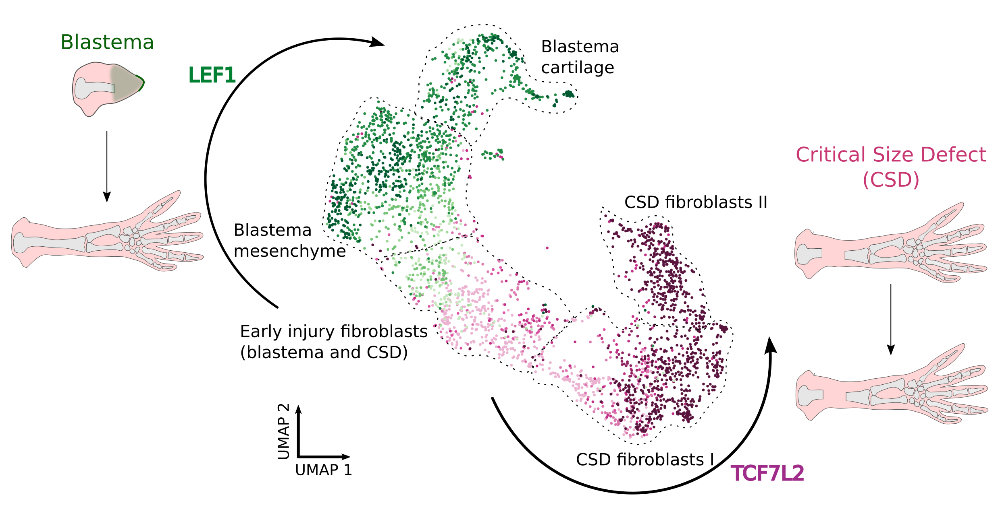

# Axolotl Bone Regeneration GRN Analysis

This repository contains the GRN analysis code for the preprint:

> Polikarpova, A.; Rivero-Garcia, I.; Gerber, T.; Wang, J.; Novatchkova, M.; Fischer, A.; Torres, M.; Sanchez-Cabo, F.; Tanaka, E. M. **Functional rescue of critical-size bone defect using molecular network analysis of axolotl limb regeneration.** bioRxiv, 2025. DOI: [10.64898/2025.12.10.692203](https://www.biorxiv.org/content/10.64898/2025.12.10.692203v4)

## Overview

We analyzed single-cell and bulk transcriptomic changes of axolotl blastema formation and critical-size defect (CSD) to identify molecular programs that distinguish successful bone regeneration from a non-regenerating injury. In particular, we focused on connective tissue (CT) cells, reconstructed gene regulatory networks (GRNs), and used network-guided candidate prioritization to identify WNT signaling as a regenerative axis that can induce cartilage growth in non-regenerative CSD.



## Main Findings

- CSD connective tissue (CT) cells fail to acquire a blastema-like progenitor state. Early BL and CSD CT cells share an injury response, but CSD cells show reduced sustained proliferation and do not activate the limb bud-like progenitor program seen in regenerating blastema.
- BL and CSD are governed by distinct GRN architectures. GRN inference shows that the blastema network has a hub-rich topology characteristic of regulatory networks, whereas the CSD network shows fewer hub-like regulators.
- GRN-guided candidate prioritization points to WNT signaling. We ranked regulators by combining differential gene expression with changes in GRN centrality between BL and CSD, which highlighted the WNT effectors LEF1 and TCF7L2 as candidate drivers of the divergent injury outcomes.
- WNT network modeling reveals injury-specific regulatory logic. CNNC-based modeling of WNT pathway interactions showed that early BL and CSD CT cells differ in WNT pathway regulation, with active WNT associated with blastema and LEF1, and less active WNT associated with CSD and TCF7L2.
- LEF1 and TCF7L2 define opposing regulatory programs. Predicted target analysis and in silico perturbations suggest that LEF1 promotes blastema-like trajectories, while TCF7L2 is linked to the non-regenerating CSD state.
- Wnt3a is sufficient to partially rescue the CSD. Repeated delivery of axolotl Wnt3a mRNA in lipid nanoparticles increases CT cell proliferation and induces cartilage bridging across the critical-size defect.


## Analysis Workflow
The scripts in `code/` are numbered to reflect the analysis flow:

1. Cell type annotation.
2. Connective tissue (CT) annotation.
3. GRN inference, network topology analysis and selection of TF candidates.
4. Wnt network modelling and identification of LEF1 and TCF7L2 regulons.
5. In silico GRN perturbations.
6. Validation analyses in bulk RNA-seq.


## Citation

If you use this repository or its outputs, please cite the associated preprint:

```text
Polikarpova A, Rivero-Garcia I, Gerber T, Wang J, Novatchkova M, Fischer A,
Torres M, Sanchez-Cabo F, Tanaka EM. Functional rescue of critical-size bone
defect using molecular network analysis of axolotl limb regeneration. bioRxiv.
2025. doi:10.64898/2025.12.10.692203
```
